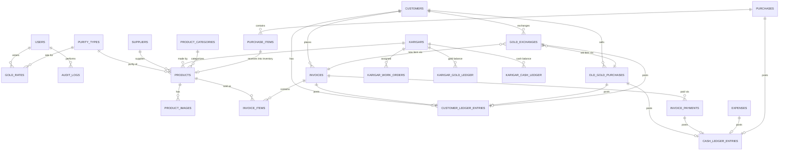
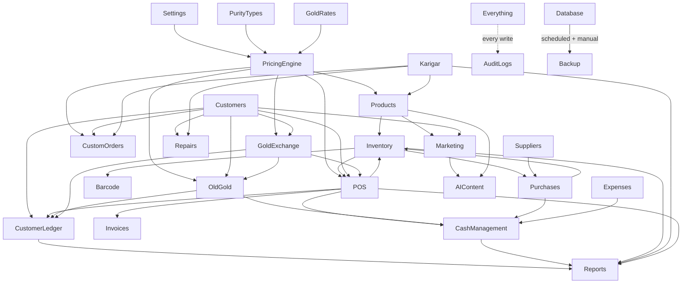

# ZARGHOON JEWELLERS ERP — System Architecture

**Business:** Zarghoon Jewellers — Liaquat Bazar, Sarafa Market, Quetta, Balochistan, Pakistan
**Document status:** Pre-implementation architecture for approval. No application code has been written yet.
**Design language:** Luxury Gold + Black, restrained, counter-fast, production-grade.

---

## 1. Complete System Architecture

Zarghoon ERP is built as a **modular monolith**, not a microservice sprawl. A jewelry shop's modules (POS, ledger, karigar, gold rates) are tightly coupled around the same financial truth — splitting them into separately-deployed services early would add network failure modes and eventual-consistency bugs to a domain that cannot tolerate either. Modules are still coded as isolated, independently-testable units inside one backend codebase, so they *could* be peeled off into services later if scale demands it.

```
┌──────────────────────────────────────────────────────────────────┐
│  Counter Terminals (LAN)          Owner / Manager (LAN or VPN)    │
│  Chrome/Edge browser, USB          Browser, tablet                │
│  barcode scanner, receipt printer                                 │
└───────────────┬─────────────────────────────┬─────────────────────┘
                │ HTTPS (local CA)             │ HTTPS over WireGuard
                ▼                              ▼
        ┌───────────────────────────────────────────┐
        │      Nginx reverse proxy (TLS, gzip)       │
        └───────────────┬─────────────────┬──────────┘
                        │                 │
             ┌──────────▼──────┐   ┌──────▼───────────┐
             │  Web app (SPA)  │   │  API server        │
             │  static build   │   │  NestJS/TypeScript │
             └──────────────────┘   └───┬───────┬───────┘
                                        │       │
                          ┌─────────────▼─┐   ┌─▼───────────────┐
                          │  PostgreSQL   │   │  Redis           │
                          │  (system of   │   │  (cache, queue,  │
                          │  record)      │   │  sessions)       │
                          └───────────────┘   └───┬──────────────┘
                                                  │
                                        ┌──────────▼──────────┐
                                        │ Background workers   │
                                        │ (BullMQ): reports,   │
                                        │ backups, reminders   │
                                        └──────────────────────┘
                          ┌───────────────────────────────┐
                          │ MinIO (S3-compatible) — product │
                          │ images/video, invoice PDFs      │
                          └───────────────────────────────┘
                          ┌───────────────────────────────┐
                          │ Encrypted off-site backup       │
                          │ target (nightly, verified)      │
                          └───────────────────────────────┘
```

**Layering inside the API server** (per module): `Controller → Service → Repository → Database`, plus a cross-cutting **Pricing Engine** and **Ledger Engine** that every transactional module (POS, Old Gold, Exchange, Karigar, Purchases) calls into rather than reimplementing money/weight math independently. This is the single most important architectural rule in this system: **there is exactly one place gold value is calculated, and exactly one place a ledger entry is written.** Every module produces *inputs* to those two engines; none of them do the arithmetic themselves.

Key architectural decisions and why:

| Decision | Reason |
|---|---|
| Modular monolith, not microservices | One database transaction can cover "sell item → deduct inventory → post ledger entry → post cash entry" atomically. Splitting these across services would need distributed transactions/sagas for no real benefit at this scale. |
| On-prem-first deployment | Sarafa Market internet is not guaranteed. The shop must be able to sell, print invoices, and update inventory with zero internet. Cloud sync/backup is additive, not load-bearing. |
| PostgreSQL over NoSQL | Jewelry accounting is inherently relational (customer → invoices → ledger → payments) and requires exact-precision numeric types, foreign keys, and multi-table transactions. |
| Shared Zod schemas between frontend/backend | Guarantees the POS form and the API agree on what a valid sale looks like, byte for byte — no drift between client and server validation. |
| USB keyboard-wedge barcode scanners | Sarafa-market-proven, zero driver installation, works as plain keyboard input — far more reliable at a counter than camera-based scanning. |

---

## 2. Recommended Technology Stack

| Layer | Choice | Why |
|---|---|---|
| Frontend | React 18 + TypeScript + Vite | Fast dev/build, huge ecosystem, easy to hire for locally. |
| UI kit | TailwindCSS + shadcn/ui (Radix primitives) | Accessible components we own the source of (no black-box vendor lock), themeable for the Gold+Black brand. |
| Server state | TanStack Query | Caching, retries, optimistic updates for POS (critical when LAN hiccups). |
| Client state | Zustand | Minimal, for cart/session/UI state only — server state never lives in it. |
| Forms/validation | React Hook Form + Zod | Zod schemas shared with backend via `packages/shared`. |
| Backend framework | NestJS (Node 20 LTS, TypeScript) | Module system maps 1:1 to business modules; built-in DI, Guards (RBAC), Interceptors (audit logging), OpenAPI generation. |
| ORM | Prisma | Type-safe queries, first-class migrations, readable schema-as-source-of-truth. |
| Database | PostgreSQL 16 | ACID transactions, `NUMERIC` exact precision for money/weight, partial indexes, row-level constraints, JSONB for flexible/rarely-queried fields (settings, audit payload). |
| Cache / queue broker | Redis 7 | Session/rate-limit store + BullMQ backing store. |
| Background jobs | BullMQ | Scheduled reports, backup verification, follow-up reminders, gold-rate digest. |
| Auth | JWT (short-lived access + rotating httpOnly refresh cookie), argon2id hashing, optional TOTP 2FA for Admin/Manager | Stateless API auth that still supports server-side revocation via a refresh-token table. |
| File/image storage | MinIO (S3-compatible, self-hosted) | Product photos/video stay on-prem; same SDK works unchanged if later moved to AWS S3/Backblaze. |
| Image processing | `sharp` | Resize/compress product photos, generate thumbnails for catalogue/marketing. |
| Barcode | Code128 via `bwip-js` (generation); scanning via USB HID scanner (keyboard-wedge, no library needed) | Matches existing shop hardware conventions. |
| Invoice printing | Browser print stylesheet (A5/A6) for laser/inkjet; `node-thermal-printer` (ESC/POS) for thermal receipt printers | Covers both invoice styles used in Pakistani retail. |
| PDF generation | `@react-pdf/renderer` or Puppeteer-to-PDF for formal invoices/reports | Server-generated, stored in MinIO, immutable copy of what was printed. |
| API contract | OpenAPI (auto-generated from NestJS decorators) | Documents every endpoint; used for a future mobile app without re-deriving the contract. |
| Testing | Vitest/Jest (unit), Supertest (API integration), Playwright (E2E for POS flow) | Money-handling code gets unit tests on the pricing/ledger engines specifically, not just smoke tests. |
| CI | GitHub Actions | Lint, typecheck, unit+integration tests, build, on every push/PR. |
| Containerization | Docker + Docker Compose | One `docker compose up` brings up the full stack identically in dev, staging, and the in-shop server. |
| Reverse proxy/TLS | Nginx + internal CA (LAN) / Let's Encrypt (if a public hostname is ever exposed) | TLS termination, static asset serving, gzip/br compression. |
| Remote access | WireGuard or Tailscale | Owner/manager can reach the shop server securely from outside without exposing it to the public internet. |

---

## 3. Folder / Project Structure

pnpm workspaces + Turborepo monorepo:

```
zarghoon-erp/
├── apps/
│   ├── api/                      # NestJS backend
│   │   ├── src/
│   │   │   ├── modules/
│   │   │   │   ├── auth/
│   │   │   │   ├── users/
│   │   │   │   ├── settings/
│   │   │   │   ├── gold-rates/
│   │   │   │   ├── products/
│   │   │   │   ├── inventory/
│   │   │   │   ├── customers/
│   │   │   │   ├── customer-ledger/
│   │   │   │   ├── suppliers/
│   │   │   │   ├── purchases/
│   │   │   │   ├── karigar/
│   │   │   │   ├── sales-pos/
│   │   │   │   ├── old-gold/
│   │   │   │   ├── gold-exchange/
│   │   │   │   ├── custom-orders/
│   │   │   │   ├── repairs/
│   │   │   │   ├── barcode/
│   │   │   │   ├── invoices/
│   │   │   │   ├── expenses/
│   │   │   │   ├── cash-management/
│   │   │   │   ├── reports/
│   │   │   │   ├── audit-logs/
│   │   │   │   ├── backup/
│   │   │   │   ├── marketing/
│   │   │   │   ├── follow-up/
│   │   │   │   └── ai-content/
│   │   │   ├── engines/
│   │   │   │   ├── pricing-engine/    # single source of truth for jewelry price math
│   │   │   │   └── ledger-engine/     # single source of truth for double-entry postings
│   │   │   ├── common/                # guards, interceptors, decorators, filters
│   │   │   └── main.ts
│   │   ├── prisma/
│   │   │   ├── schema.prisma
│   │   │   └── migrations/
│   │   └── test/
│   └── web/                      # React SPA
│       ├── src/
│       │   ├── modules/          # mirrors backend module list, one folder per screen group
│       │   ├── components/       # shared UI (Gold+Black design system components)
│       │   ├── lib/               # api client, query hooks
│       │   ├── stores/            # zustand stores
│       │   └── theme/             # design tokens (colors, spacing, typography)
│       └── public/
├── packages/
│   ├── shared-types/              # Zod schemas + inferred TS types, shared FE/BE
│   ├── pricing-formulas/          # pure, unit-tested purity/pricing math (no I/O)
│   └── config/                    # eslint/tsconfig/tailwind shared config
├── infra/
│   ├── docker/
│   │   ├── docker-compose.yml
│   │   ├── docker-compose.prod.yml
│   │   └── nginx/
│   ├── backup/                    # backup + restore + verification scripts
│   └── scripts/                   # seed data, one-off migrations
├── docs/
│   ├── ARCHITECTURE.md            # this document
│   ├── er-diagram.md
│   ├── permissions-matrix.md
│   └── runbooks/                  # backup/restore, incident response
├── .github/workflows/ci.yml
├── turbo.json
├── pnpm-workspace.yaml
└── package.json
```

---

## 4. Database Architecture

**Core conventions, applied to every table:**

- Primary key: `id UUID DEFAULT gen_random_uuid()` — safe to generate client-side offline if ever needed, no collision risk across terminals.
- Every business table carries audit columns: `created_at`, `updated_at`, `created_by_id`, `updated_by_id`.
- **Financial and inventory-affecting tables are never hard-deleted.** They carry a `status` or `voided_at`/`voided_by_id`/`void_reason` column. Corrections happen via a reversing entry, never an `UPDATE` that changes historical amounts.
- Money stored as `NUMERIC(14,2)` in PKR (no floating point, ever). Gold weight stored as `NUMERIC(10,3)` grams. Gold rate stored as `NUMERIC(12,2)` PKR/gram.
- Every table that references "the purity used" or "the rate used" in a transaction stores the **resolved numeric values at transaction time**, not just a foreign key to today's rate — see §Pricing Engine note in §1 and the `applied_*` columns below. This is what makes historical transactions auditable even after gold rates move.
- Foreign keys are `RESTRICT` by default (never silently cascade-delete a customer's transaction history); soft-referenced lookups (category, status) use enums or small reference tables, not magic strings.
- Every list-heavy table gets indexes on its typical filter columns (`customer_id`, `created_at`, `status`, `barcode`).
- Multi-step business operations (a sale: inventory update + invoice + ledger entry + cash entry) execute inside a single DB transaction — partial writes are not acceptable in a financial system.

**Representative core tables (Phase 0–3 scope):**

- `users`, `roles`, `permissions`, `role_permissions`
- `settings` (key/value + typed JSONB, versioned)
- `purity_types` (24K/22K/21K/20K/18K/14K, configurable, `karat_factor`)
- `gold_rates` (date, time, purity_id, buy_rate, sell_rate, entered_by_id — append-only)
- `product_categories`, `product_subcategories`
- `products` (all fields from the spec — weight, purity_id, stone data, charges, status)
- `product_images`
- `suppliers`
- `karigars`, `karigar_work_orders`, `karigar_gold_ledger`, `karigar_cash_ledger`
- `customers`
- `customer_ledger_entries` (date, reference_type, reference_id, description, debit, credit, running_balance, user_id, timestamp)
- `invoices`, `invoice_items`, `invoice_payments`
- `old_gold_purchases`
- `gold_exchanges`
- `cash_ledger_entries`, `cash_drawer_sessions` (open/close, reconciliation)
- `expenses`
- `purchases`, `purchase_items`
- `audit_logs` (actor, action, entity, entity_id, before_json, after_json, ip, timestamp)
- `backup_runs` (started_at, finished_at, target, checksum, verified_at, verification_result)

Full column-level DDL is produced at Phase 0 implementation time (as a Prisma schema), not in this architecture pass.

---

## 5. Entity Relationship Overview



The two ledger tables (`customer_ledger_entries`, `cash_ledger_entries`) are the system's financial spine: **every** money-moving or gold-moving event in every module posts to one or both of them through the Ledger Engine. Reports (§ below) are read-models built by querying these ledgers, not by re-deriving totals from each module independently — this guarantees the Reports module and the Ledger always agree.

---

## 6. User Roles & Permissions

| Module / Action | Admin | Manager | Salesperson | Accountant | Inventory Staff |
|---|---|---|---|---|---|
| Dashboard | Full | Full | View (own sales) | Full | View (inventory) |
| Gold Rates — enter/edit | Full | Full | View | View | View |
| Products / Inventory | Full | Full | View + Search | View | Full |
| Sales / POS | Full | Full | Create/Print | View | — |
| Sale cancellation/void | Full | Approve | Request only | View | — |
| Purchases | Full | Full | — | Create/Edit | View |
| Customers | Full | Full | Create/Edit | View | — |
| Customer Ledger | Full | Full | View own | Full | — |
| Ledger correction/reversal | Full | Approve | — | Request only | — |
| Suppliers | Full | Full | View | Create/Edit | View |
| Karigar Management | Full | Full | — | View | Create/Edit |
| Cash Management / drawer | Full | Full | Own drawer only | Full | — |
| Old Gold Purchase | Full | Approve | Create (needs approval) | View | — |
| Gold Exchange | Full | Approve | Create (needs approval) | View | — |
| Custom Orders | Full | Full | Create/Edit | View | View |
| Repairs | Full | Full | Create/Edit | View | Update status |
| Invoices | Full | Full | Create/Print | View/Export | — |
| Expenses | Full | Full | — | Create/Edit | — |
| Reports | Full | Full | Own sales only | Full | Inventory only |
| Users & Permissions | Full | View | — | — | — |
| Settings (pricing rules, purities) | Full | View | — | — | — |
| Audit Logs | Full | View | — | View (own) | — |
| Backup & Restore | Full | View status | — | — | — |
| Marketing / AI Content | Full | Full | — | — | — |

Rules that hold regardless of role:
- **No role can hard-delete** a posted invoice, ledger entry, gold rate, or ledger-affecting transaction. Only void/reverse with a reason, and voids above a configurable threshold require Manager/Admin approval.
- Every permission is enforced **server-side** via NestJS Guards reading the `role_permissions` table — the frontend hiding a button is UX, not security.
- Permissions are seeded per-role but stored data-driven (not hard-coded switch statements), so the Admin can fine-tune them per employee from the Users & Permissions module without a code change.

---

## 7. Module Dependency Map



**Load-bearing implication:** `Settings`, `Gold Rates`, and the `Pricing Engine` must exist before *anything* transactional can be built. This dictates the roadmap in §8 — pricing correctness is Phase 0, not a later refinement.

---

## 8. Development Roadmap

Each phase follows the mandated cycle: architecture → DB changes → API changes → frontend changes → implement → test → fix → verify → only then proceed. No phase starts until the previous one is demoed and approved.

| Phase | Scope | Depends on |
|---|---|---|
| **0 — Foundation** | Auth, Users & Permissions, Settings, Purity Types, Gold Rates module, Pricing Engine (core formulas, unit-tested), Audit Logs infrastructure, base design system (Gold+Black theme, layout shell, dashboard skeleton) | — |
| **1 — Catalogue** | Products, Product Categories, Inventory, Barcode generation/scan, product images | Phase 0 |
| **2 — Customers & Ledger** | Customers, Customer Ledger, ledger running-balance logic | Phase 0 |
| **3 — Sales / POS** | POS screen, Invoices, Invoice printing (A5 + thermal), Cash Management (drawer open/close) | Phases 0–2 |
| **4 — Purchases & Suppliers** | Suppliers, Purchases, receiving into inventory | Phases 0–1 |
| **5 — Karigar Management** | Karigars, work orders, gold/cash payable-receivable ledgers, dashboard widgets | Phases 0–1 |
| **6 — Old Gold & Exchange** | Old Gold Purchase, Gold Exchange, approval workflow | Phases 0–3 |
| **7 — Cash & Reports v1** | Full Cash Management reconciliation, Sales/Inventory/Customer core reports | Phases 3–6 |
| **8 — Service Modules** | Custom Orders, Repairs | Phases 0–2, 5 |
| **9 — Expenses & Reports v2** | Expenses module, Profit reports, Gold reports, Karigar reports | Phase 7 |
| **10 — Security & Backup Hardening** | 2FA, full audit-log UI, backup automation + verification job, restore runbook drilled end-to-end | All prior |
| **11 — Marketing & Catalogue Front** | Product Catalogue (external-facing), Marketing module, Customer Follow-up | Phase 1–2 |
| **12 — AI Content** | AI-assisted description/caption generation, strictly bound to verified product data | Phase 11 |
| **13 — Scale hardening** | Multi-branch support (if needed), performance tuning, load testing, mobile-friendly counter view | All prior |

Nothing beyond Phase 0 begins in this task without your explicit go-ahead, per your instructions.

---

## 9. Security Architecture

**Authentication**
- Password hashing: argon2id.
- JWT access token (15 min) + rotating refresh token in an httpOnly, `SameSite=Strict` cookie; refresh tokens are tracked server-side in a table so any session can be force-revoked (e.g., ex-employee).
- Optional TOTP 2FA, enforced for Admin and Manager roles.
- Login attempts rate-limited and logged; lockout after repeated failures.

**Authorization**
- RBAC enforced by NestJS Guards on every route, checked against the data-driven `role_permissions` table (§6) — never a hard-coded role check scattered across controllers.
- Sensitive actions (void invoice, edit posted ledger entry, change gold rate retroactively — which is disallowed outright, edit customer CNIC, change user roles) require a documented "approval" record: who approved, when, why.

**Data protection**
- TLS everywhere, including LAN traffic (internal CA issued to shop devices) — a jewelry shop's customer CNIC and ledger data does not travel in plaintext even on the local network.
- CNIC and other identification fields are stored **encrypted at rest** (application-level AES-256-GCM, key held outside the DB) and masked in the UI except to roles that need it.
- All input validated against the shared Zod schemas server-side (never trust client validation alone) — closes off injection and malformed-data classes of bugs.
- Prisma parameterizes all queries by default — no raw string-concatenated SQL.
- Standard hardening: Helmet (security headers), strict CORS allow-list, CSRF token for cookie-based refresh flow, output encoding in React (default XSS-safe) with a documented exception process for any `dangerouslySetInnerHTML` use.

**Audit logging**
- Every create/update/void on a financial or inventory-affecting entity writes an `audit_logs` row via a single NestJS Interceptor (not per-module ad hoc calls) — capturing actor, action, entity, before/after JSON diff, IP, timestamp. This guarantees no module can accidentally skip audit logging.
- Audit logs are themselves append-only (no update/delete permission exists for that table at the DB role level).

**Financial immutability**
- Posted invoices, ledger entries, and gold-rate records are never mutated. Corrections are always a new reversing/adjusting entry that references the original, so the audit trail tells the true story of what happened and when it was corrected.

**Secrets**
- `.env` files never committed; `.env.example` documents required keys. Production secrets loaded via Docker secrets/host environment, with a documented path to a proper secrets manager (Vault/1Password Connect) if the system grows past one shop.

---

## 10. Backup Architecture

Trust is earned by verification, not by a cron job's exit code — a backup that never restores successfully is not a backup.

- **Mechanism:** nightly `pg_dump` (custom format) of PostgreSQL, plus continuous WAL archiving for point-in-time recovery between nightly snapshots. MinIO object data (product photos/videos, generated invoice PDFs) synced alongside.
- **Manual backup:** an explicit "Backup Now" action in the Backup & Restore module, available to Admin, which runs the same job on demand and reports success/failure with a checksum.
- **Retention:** 30 daily, 12 weekly, 12 monthly snapshots, pruned automatically.
- **Off-site copy:** every snapshot is encrypted (age/GPG) and pushed to an off-site target (e.g., Backblaze B2 or a second physical location) — a fire/theft at the shop must not be a total-loss event.
- **Verification (mandatory, not optional):** a scheduled worker job restores the latest snapshot into a scratch database on a schedule (e.g., weekly), runs row-count and checksum comparisons against expected values, and records the result in `backup_runs.verification_result`. The Backup & Restore UI shows the **last verified-good** backup timestamp, not just the last-attempted one — "backup succeeded" is never claimed on write success alone.
- **Restore procedure:** documented, versioned runbook in `docs/runbooks/restore.md`, covering both full restore and point-in-time restore, and includes the steps to redirect the app at a restored DB for validation before cutting traffic over.
- **Drill requirement:** Phase 10 explicitly includes performing a real restore drill end-to-end before this is considered production-ready — a backup system that has never been restore-tested is unverified by definition.

---

## 11. Deployment Architecture

**Primary model: on-prem, LAN-first.**

- A dedicated small-form-factor Linux server (or mini-PC) lives at the shop, running the full Docker Compose stack: Nginx, API, Postgres, Redis, MinIO, background workers, backup service.
- Counter terminals (desktop/tablet, USB barcode scanner + receipt printer attached) connect over the shop's LAN via HTTPS to the in-shop server — **sales continue uninterrupted even if the internet is down.**
- The owner/manager can reach the same server securely from outside the shop over WireGuard (or Tailscale) — no port is opened directly to the public internet, minimizing attack surface for a system holding customer financial data.
- Nightly backups push off-site over whatever internet connection is available at the time; if the connection is down that night, the local snapshot still exists and the off-site push retries.

**Environments:**
- **Dev:** local Docker Compose, seeded fake data, no real customer data ever.
- **Staging:** mirrors production compose stack, used to rehearse each phase's deployment and the backup/restore drill before touching the real shop server.
- **Production:** the in-shop server described above.

**CI/CD:**
- GitHub Actions runs lint, typecheck, unit tests, integration tests, and a production build on every push/PR.
- Deployment to the shop server is a manual, deliberate step (`docker compose pull && docker compose up -d` against a tagged release) — never auto-deployed on merge, given this is a live financial system with a single production instance.

**Future scale path (documented now, not built now):** if Zarghoon opens a second branch, the same modular-monolith API can run centrally in a small cloud VPS with each branch connecting over VPN, or each branch keeps a local instance with a nightly reconciliation job — decision deferred until it's a real requirement, not guessed at today.

---

## Open Decisions Requiring Your Approval

1. **Pricing formula default:** should the default purity pricing method be *direct rate per purity* (you enter a rate for 22K and a separate rate for 21K each day) or *derived from 24K* (you enter only the 24K rate and the system computes `24K_rate × karat/24` for the rest)? Both will be supported and configurable in Settings, but one needs to be the default.
2. **CNIC collection:** confirm this is legally required/appropriate for your transaction sizes under current Pakistani regulations for precious-metal dealers, so the field is mandatory vs. optional in the schema.
3. **Making-charge model:** confirm whether making charges are typically per-gram, a flat percentage of gold value, a flat amount per item, or vary by category — this determines the Settings schema for the Pricing Engine.
4. **Hardware confirmation:** confirm the shop will have (a) a always-on local server device, (b) a USB keyboard-wedge barcode scanner, and (c) a receipt or A5 printer, so Phase 0/1 targets real hardware rather than assumptions.

---

**This document is the deliverable for the current task.** No implementation has started. Once you approve this architecture (and the tech stack, folder structure, and roadmap in it), Phase 0 begins: Auth, Users & Permissions, Settings, Gold Rates, and the Pricing Engine core.
